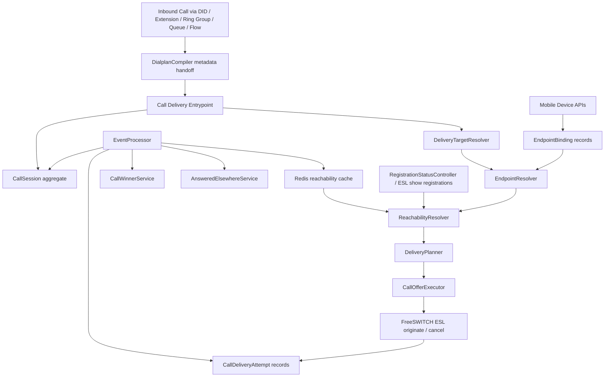
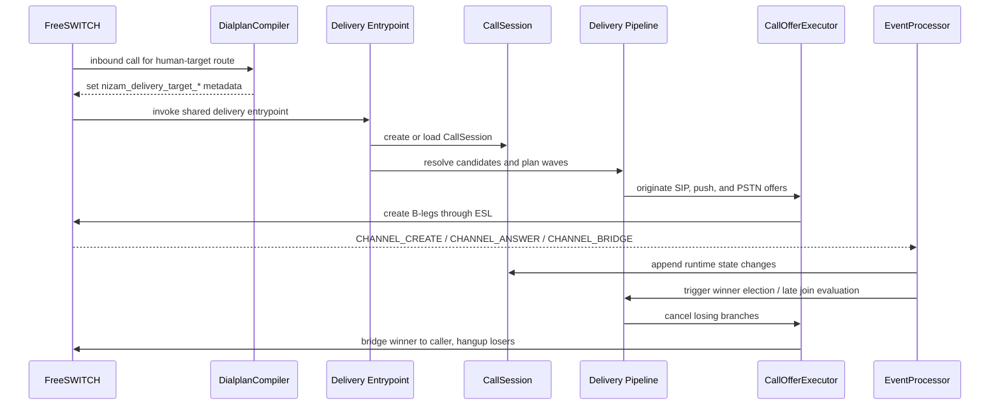
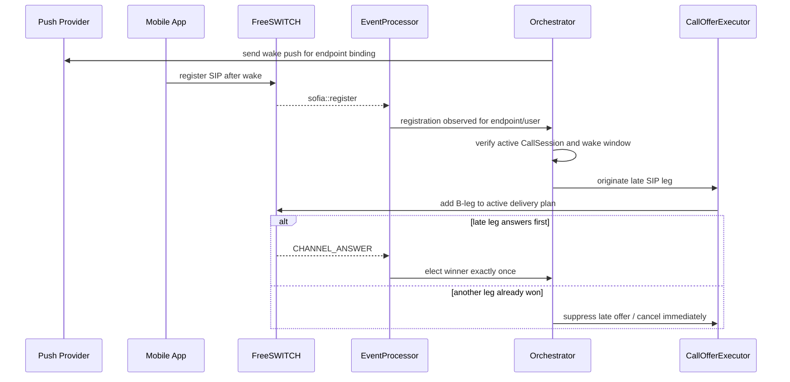
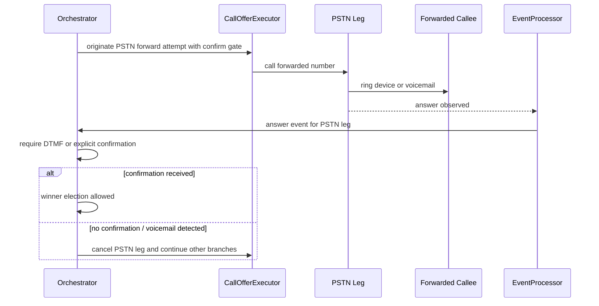

# Design Document: call-delivery-orchestration

## Overview

This feature introduces a single runtime call delivery orchestration layer for all human-target destinations in NIZAM. Instead of embedding reachability and ringing behavior independently inside direct extension routing, ring groups, queue delivery, and flow branches, inbound calls will converge into one shared pipeline that resolves candidate endpoints, evaluates reachability, wakes dormant mobile devices, adds late-arriving SIP legs, and elects exactly one winner.

The design builds on what already exists in the repository. `DialplanCompiler` already resolves DID, extension, ring group, time condition, flow, and policy entrypoints, but it currently compiles human delivery mostly as direct `bridge user/<extension>@<domain>` or static multi-bridge ring-group behavior. `EventProcessor` already ingests `CHANNEL_CREATE`, `CHANNEL_ANSWER`, `CHANNEL_BRIDGE`, `CHANNEL_HANGUP_COMPLETE`, `sofia::register`, and `sofia::unregister`, while `RegistrationStatusController` can query live registrations from FreeSWITCH. `CallSession` already exists with `lock_version`, plus `call_events` and `call_trace_events` already relate to a runtime call spine. This feature turns those pieces into a canonical orchestrated delivery model instead of parallel, duplicated implementations.

The target behavior is consistent across direct extensions, ring groups, queue agents, and people-targeting flow branches. Online SIP devices ring immediately. Dormant push-capable devices receive push in parallel. Devices that register within a short wake window can join the active call attempt late. Forwarded PSTN branches are supported safely through explicit answer confirmation so voicemail does not steal the call. First confirmed answer wins once, and all losing branches are cancelled deterministically with answered-elsewhere notifications sent to non-winning mobile devices.

## Architecture

The orchestration path moves delivery policy out of dialplan branching and into an application-controlled runtime service. The dialplan remains the route entry mechanism, but human delivery is handed off to a shared orchestration entrypoint by passing metadata into the caller leg. Runtime orchestration then uses ESL, existing FreeSWITCH events, and short-lived Redis reachability state to control and reconcile B-leg offers.



## Sequence Diagrams

### Main inbound delivery flow



### Late mobile registration after push



### PSTN forward confirmation flow



## Components and Interfaces

### Component 1: Delivery Entrypoint

Purpose: accepts caller legs for any human-target route, creates or loads the `CallSession`, and invokes the shared orchestration pipeline.

Interface:

```pascal
PROCEDURE enterHumanDelivery(call_uuid, organization_id, delivery_target_type, delivery_target_id, metadata)
  INPUT: inbound call identifiers and route metadata
  OUTPUT: call_session_id

  SEQUENCE
    call_session ← findOrCreateCallSession(call_uuid, organization_id, metadata)
    storeDeliveryMetadata(call_session, delivery_target_type, delivery_target_id)
    parkCallerLegInControlledState(call_session)
    orchestrateDelivery(call_session)
    RETURN call_session.id
  END SEQUENCE
END PROCEDURE
```

Responsibilities:
- normalize route handoff from extension, DID, ring group, queue, and flow paths
- create or load the correlated `CallSession` using the inbound call UUID and organization context
- persist stable orchestration metadata on `CallSession.variables`
- ensure caller leg is held until a winner is elected or all branches fail
- make entrypoint execution idempotent for repeated FreeSWITCH lookups on the same active caller leg

### Component 2: DeliveryTargetResolver

Purpose: maps route metadata into a canonical logical target set before endpoint expansion.

Interface:

```pascal
PROCEDURE resolveDeliveryTargets(call_session)
  INPUT: call_session with target_type and target_id
  OUTPUT: target_set

  SEQUENCE
    CASE call_session.target_type OF
      extension: RETURN one extension target
      ring_group: RETURN ring group target with member extensions
      queue: RETURN eligible agent targets from queue strategy
      flow: RETURN human-target branch outputs only
      time_condition: RETURN matched human-target branch
      did: RETURN resolved downstream human target
    END CASE
  END SEQUENCE
END PROCEDURE
```

Responsibilities:
- keep queue, ring group, extension, and flow resolution distinct from endpoint reachability logic
- preserve source context for auditing and downstream policy
- reject non-human routes early so voicemail, IVR, and non-human branches bypass orchestration

### Component 3: EndpointResolver

Purpose: expands logical targets into endpoint candidates using a new runtime endpoint binding model rather than `DeviceProfile`.

Interface:

```pascal
STRUCTURE EndpointBinding
  id: UUID
  organization_id: UUID
  extension_id: UUID OR NULL
  agent_id: UUID OR NULL
  type: String
  device_uuid: String OR NULL
  push_token: String OR NULL
  voip_push_token: String OR NULL
  platform: String OR NULL
  app_version: String OR NULL
  is_push_capable: Boolean
  is_enabled: Boolean
  rings_immediately_when_online: Boolean
  allow_late_join_after_push: Boolean
  forward_number: String OR NULL
  forward_requires_confirm: Boolean
  last_seen_at: Timestamp OR NULL
  last_registered_at: Timestamp OR NULL
  metadata: Map
END STRUCTURE

STRUCTURE EndpointCandidate
  endpoint_binding_id: UUID
  owner_type: String
  owner_id: UUID
  candidate_type: String
  sip_aor: String OR NULL
  push_capable: Boolean
  online_now: Boolean
  allow_late_join_after_push: Boolean
  forward_number: String OR NULL
  forward_requires_confirm: Boolean
  priority: Integer
  source_path: String
END STRUCTURE

PROCEDURE resolveEndpoints(target_set)
  INPUT: logical targets
  OUTPUT: endpoint_candidates
END PROCEDURE
```

Responsibilities:
- produce one canonical candidate shape for direct extensions, ring-group members, and queue agents
- merge extension-bound, agent-bound, mobile, desk-phone, and forwarded-number runtime endpoints
- isolate runtime call delivery state from provisioning state in `DeviceProfile`

### Component 4: ReachabilityResolver

Purpose: determines which candidates are immediately callable, push-wakeable, delayed, or ineligible.

Interface:

```pascal
STRUCTURE ReachabilityDecision
  endpoint_binding_id: UUID
  status: String
  can_ring_now: Boolean
  should_send_push: Boolean
  allow_late_join_window_until: Timestamp OR NULL
  should_offer_pstn: Boolean
  decision_reason: String
END STRUCTURE

PROCEDURE resolveReachability(call_session, endpoint_candidates)
  INPUT: call_session, endpoint_candidates
  OUTPUT: reachability_decisions

  SEQUENCE
    registrations ← readRedisCacheOrQueryESL(call_session.organization_id)
    FOR each candidate IN endpoint_candidates DO
      classify candidate as online_sip, dormant_push, pstn_forward, or unavailable
    END FOR
    RETURN reachability_decisions
  END SEQUENCE
END PROCEDURE
```

Responsibilities:
- use Redis reachability cache keyed by organization and extension or endpoint binding
- fall back to existing ESL-backed registration visibility when cache is cold
- separate online-now reachability from push wake eligibility

### Component 5: DeliveryPlanner

Purpose: converts candidates and reachability decisions into executable offer waves.

Interface:

```pascal
STRUCTURE DeliveryPlan
  call_session_id: UUID
  wake_window_seconds: Integer
  immediate_sip_wave: List of EndpointCandidate
  immediate_push_wave: List of EndpointCandidate
  delayed_pstn_wave: List of EndpointCandidate
  cancellation_policy: Map
END STRUCTURE

PROCEDURE createDeliveryPlan(call_session, candidates, reachability_decisions)
  INPUT: call_session, endpoint candidates, reachability decisions
  OUTPUT: delivery_plan
END PROCEDURE
```

Responsibilities:
- ring online SIP first without waiting for push
- send push in parallel for dormant mobile endpoints
- optionally delay PSTN forward attempts behind SIP or push waves
- encode policy flags for answer confirmation and late join windows

### Component 6: CallOfferExecutor

Purpose: executes plan waves through ESL and records every offer as a `CallDeliveryAttempt`.

Interface:

```pascal
STRUCTURE CallDeliveryAttempt
  id: UUID
  call_session_id: UUID
  endpoint_binding_id: UUID
  attempt_type: String
  status: String
  freeswitch_leg_uuid: String OR NULL
  started_at: Timestamp
  answered_at: Timestamp OR NULL
  ended_at: Timestamp OR NULL
  failure_reason: String OR NULL
END STRUCTURE

PROCEDURE executePlan(delivery_plan)
  INPUT: delivery_plan
  OUTPUT: attempt_list

  SEQUENCE
    originateImmediateSipLegs()
    sendPushNotifications()
    scheduleDelayedPstnOffersIfConfigured()
    persistCallDeliveryAttempts()
    RETURN attempt_list
  END SEQUENCE
END PROCEDURE
```

Responsibilities:
- originate SIP and PSTN B-legs through ESL instead of embedding policy in dialplan bridge strings
- create durable attempt records for observability and race reconciliation
- support cancellation, timeout, and winner-bridge operations idempotently

### Component 7: CallWinnerService

Purpose: elects one winning branch exactly once using `CallSession.lock_version` and durable attempt state.

Interface:

```pascal
PROCEDURE electWinner(call_session, candidate_attempt)
  INPUT: call_session, answered or confirmed attempt
  OUTPUT: winner_result

  SEQUENCE
    ACQUIRE optimistic_lock USING call_session.lock_version
    IF call_session already has winner THEN
      mark candidate_attempt as lost
      RETURN existing winner
    END IF

    IF candidate_attempt requires confirmation AND confirmation missing THEN
      mark candidate_attempt as pending_confirmation
      RETURN no_winner
    END IF

    mark candidate_attempt as won
    store winner metadata on call_session
    increment call_session.lock_version
    RETURN winner
  END SEQUENCE
END PROCEDURE
```

Responsibilities:
- prevent double-win race when multiple endpoints answer near-simultaneously
- gate PSTN forwarded legs on answer confirmation
- coordinate final bridge and loser cancellation with at-most-once semantics

### Component 8: AnsweredElsewhereService

Purpose: sends loser cleanup signals to all non-winning mobile devices and updates push lifecycle state.

Interface:

```pascal
PROCEDURE notifyAnsweredElsewhere(call_session, winning_attempt, losing_attempts)
  INPUT: call_session, winner, losers
  OUTPUT: NONE
END PROCEDURE
```

Responsibilities:
- send cancel or answered-elsewhere push to dormant and ringing app devices
- suppress stale late-join behavior once a winner exists
- provide audit visibility for push cancellation outcomes

## Data Models

### Model 1: EndpointBinding

```pascal
STRUCTURE EndpointBinding
  id: UUID
  organization_id: UUID
  extension_id: UUID OR NULL
  agent_id: UUID OR NULL
  type: ENUM(desk_phone, mobile_app, pstn_forward, softphone, agent_endpoint)
  device_uuid: String OR NULL
  push_token: String OR NULL
  voip_push_token: String OR NULL
  platform: ENUM(ios, android, web, unknown) OR NULL
  app_version: String OR NULL
  is_push_capable: Boolean
  is_enabled: Boolean
  rings_immediately_when_online: Boolean
  allow_late_join_after_push: Boolean
  forward_number: String OR NULL
  forward_requires_confirm: Boolean
  last_seen_at: Timestamp OR NULL
  last_registered_at: Timestamp OR NULL
  metadata: Map
  created_at: Timestamp
  updated_at: Timestamp
END STRUCTURE
```

Validation rules:
- must belong to exactly one organization
- at least one of `extension_id` or `agent_id` must be present for human-target routing
- `push_token` or `voip_push_token` required when `is_push_capable = true`
- `forward_number` required only for `pstn_forward` type
- `DeviceProfile` remains provisioning-only and is not reused for runtime endpoint state

### Model 2: CallDeliveryAttempt

```pascal
STRUCTURE CallDeliveryAttempt
  id: UUID
  call_session_id: UUID
  endpoint_binding_id: UUID
  attempt_type: ENUM(sip, push, pstn, late_sip, cancel, answered_elsewhere)
  status: ENUM(planned, initiated, ringing, answered, confirmed, won, lost, cancelled, failed, timed_out)
  freeswitch_leg_uuid: String OR NULL
  started_at: Timestamp
  answered_at: Timestamp OR NULL
  ended_at: Timestamp OR NULL
  failure_reason: String OR NULL
  metadata: Map
END STRUCTURE
```

Validation rules:
- every delivery attempt belongs to exactly one `CallSession`
- a SIP or PSTN attempt may have at most one active FreeSWITCH leg UUID
- winner status is unique per `call_session_id`
- losing attempts must end in `lost`, `cancelled`, `failed`, or `timed_out`

### Model 3: Optional support tables

```pascal
STRUCTURE PushNotificationLog
  id: UUID
  call_session_id: UUID
  endpoint_binding_id: UUID
  push_type: String
  provider_message_id: String OR NULL
  status: String
  sent_at: Timestamp
  response_payload: Map OR NULL
END STRUCTURE

STRUCTURE DeviceRegistrationSnapshot
  id: UUID
  organization_id: UUID
  endpoint_binding_id: UUID OR NULL
  extension_id: UUID OR NULL
  registration_key: String
  registered: Boolean
  user_agent: String OR NULL
  network_ip: String OR NULL
  observed_at: Timestamp
END STRUCTURE
```

Validation rules:
- support tables are append-heavy and should avoid becoming the source of truth for winner election
- Redis remains the short-lived operational cache; database tables remain audit and recovery aids

## Algorithmic Pseudocode

### Main orchestration algorithm

```pascal
PROCEDURE orchestrateDelivery(call_session)
  INPUT: call_session
  OUTPUT: orchestration_result

  SEQUENCE
    ASSERT call_session IS NOT NULL
    ASSERT call_session.state IS NOT ended

    targets ← resolveDeliveryTargets(call_session)
    candidates ← resolveEndpoints(targets)
    reachability ← resolveReachability(call_session, candidates)
    plan ← createDeliveryPlan(call_session, candidates, reachability)

    recordTrace(call_session, "delivery.plan.created", plan)
    executePlan(plan)

    WHILE call_session.state IS waiting_for_winner DO
      ASSERT noMoreThanOneWinnerPersisted(call_session)
      ASSERT allActiveAttemptsBelongTo(call_session)

      event ← waitForRelevantDeliveryEvent(call_session)

      IF event.type EQUALS channel_answer THEN
        electWinner(call_session, event.attempt)
      END IF

      IF event.type EQUALS channel_bridge THEN
        markWinningBridge(call_session, event.attempt)
      END IF

      IF event.type EQUALS sofia_register THEN
        tryLateJoinAfterPush(call_session, event)
      END IF

      IF allAttemptsTerminal(call_session) AND noWinnerExists(call_session) THEN
        finalizeNoAnswer(call_session)
        RETURN no_answer
      END IF
    END WHILE

    cancelLosingBranches(call_session)
    sendAnsweredElsewhereSignals(call_session)
    RETURN winnerSelected(call_session)
  END SEQUENCE
END PROCEDURE
```

Preconditions:
- `call_session` exists and belongs to an operational organization
- route metadata identifies a human-target delivery path
- all required repository integrations are available: ESL control, event ingestion, persistence, and Redis cache

Postconditions:
- zero or one winning delivery attempt exists for the session
- all non-winning attempts are terminalized deterministically
- caller leg is bridged to the winner or finalized as unanswered
- traceable attempt history exists for audit and debugging

Loop invariants:
- at most one attempt can be marked `won`
- all active attempts belong to the same `call_session_id`
- once a winner is stored, no new winner can be elected

### Late join algorithm for pushed devices

```pascal
PROCEDURE tryLateJoinAfterPush(call_session, registration_event)
  INPUT: active call_session, registration_event
  OUTPUT: late_join_result

  SEQUENCE
    ASSERT registration_event.action EQUALS registered

    IF winnerAlreadyExists(call_session) THEN
      RETURN ignored_because_winner_exists
    END IF

    endpoint ← mapRegistrationToEndpointBinding(registration_event)

    IF endpoint IS NULL THEN
      RETURN ignored_unknown_endpoint
    END IF

    IF endpoint.allow_late_join_after_push IS false THEN
      RETURN ignored_late_join_disabled
    END IF

    IF wakeWindowExpired(call_session, endpoint) THEN
      RETURN ignored_wake_window_expired
    END IF

    IF existingActiveSipAttemptExists(call_session, endpoint) THEN
      RETURN ignored_duplicate_attempt
    END IF

    late_attempt ← originateLateSipLeg(call_session, endpoint)
    recordTrace(call_session, "delivery.late_join.originated", late_attempt)
    RETURN late_attempt
  END SEQUENCE
END PROCEDURE
```

Preconditions:
- registration event is trusted and organization-scoped
- the endpoint binding belongs to the same organization as the call session

Postconditions:
- a late SIP leg is added at most once per eligible endpoint during wake window
- no late leg is created after a winner is committed

Loop invariants:
- no duplicate active SIP attempt exists for the same endpoint within a call session

### Winner election algorithm

```pascal
PROCEDURE electWinner(call_session, attempt)
  INPUT: call_session, attempt
  OUTPUT: election_result

  SEQUENCE
    ASSERT attempt.status IN {answered, confirmed}

    session_copy ← reloadCallSessionForUpdate(call_session.id)

    IF session_copy.variables.winner_attempt_id IS NOT NULL THEN
      markAttemptLost(attempt, "winner_already_committed")
      RETURN existing_winner
    END IF

    IF attempt.attempt_type EQUALS pstn AND requiresConfirmation(attempt) THEN
      IF confirmationReceived(attempt) IS false THEN
        markAttemptPendingConfirmation(attempt)
        RETURN waiting_for_confirmation
      END IF
    END IF

    markAttemptWon(attempt)
    session_copy.variables.winner_attempt_id ← attempt.id
    session_copy.state ← bridged
    session_copy.lock_version ← session_copy.lock_version + 1
    save(session_copy)

    bridgeCallerToWinner(session_copy, attempt)
    cancelOtherAttempts(session_copy, attempt.id)
    RETURN winner_committed
  END SEQUENCE
END PROCEDURE
```

Preconditions:
- the attempt belongs to the provided call session
- answer or confirmation has been observed through trusted event ingestion

Postconditions:
- exactly one winning attempt is committed
- all other active attempts become losers or are cancelled
- caller leg is bridged only after the winner is committed

Loop invariants:
- `winner_attempt_id` is immutable once set
- `lock_version` increases on every committed winner transition

## Key Functions with Formal Specifications

### Function 1: resolveDeliveryTargets()

```pascal
PROCEDURE resolveDeliveryTargets(call_session)
```

Preconditions:
- `call_session.variables.nizam_delivery_target_type` is present
- `call_session.variables.nizam_delivery_target_id` is present
- target belongs to the same organization as the call session

Postconditions:
- returns a canonical target set for one route origin
- queue targets include only eligible agents according to current queue strategy
- non-human branches are excluded from orchestration output
- no reachability or push decision is performed here

Loop invariants:
- every produced target preserves a source path reference for observability

### Function 2: resolveReachability()

```pascal
PROCEDURE resolveReachability(call_session, endpoint_candidates)
```

Preconditions:
- all endpoint candidates are organization-scoped and enabled
- Redis and ESL accessors are available, even if one source is degraded

Postconditions:
- every candidate receives exactly one reachability classification
- online SIP candidates are flagged `can_ring_now = true`
- dormant push-capable candidates are flagged `should_send_push = true`
- PSTN forward candidates preserve confirmation requirements

Loop invariants:
- previously classified candidates retain their classification unless the input set changes
- classification does not mutate endpoint bindings

### Function 3: executePlan()

```pascal
PROCEDURE executePlan(delivery_plan)
```

Preconditions:
- plan references an existing active call session
- all endpoint bindings in the plan are enabled and organization-scoped

Postconditions:
- every initiated offer yields a persisted `CallDeliveryAttempt`
- push sends are recorded separately from SIP and PSTN legs
- PSTN legs that require confirmation are marked as such before election

Loop invariants:
- every emitted FreeSWITCH leg UUID maps back to one persisted attempt
- no duplicate active attempt is created for the same endpoint and wave

### Function 4: notifyAnsweredElsewhere()

```pascal
PROCEDURE notifyAnsweredElsewhere(call_session, winning_attempt, losing_attempts)
```

Preconditions:
- `winning_attempt` is already committed as the session winner
- all losing attempts belong to the same call session

Postconditions:
- non-winning mobile endpoints receive cancel or answered-elsewhere notifications
- push wake flows are suppressed after a winner exists
- delivery logs capture notification outcomes without affecting winner state

Loop invariants:
- notifying losers cannot change the winning attempt

## Example Usage

```pascal
SEQUENCE
  metadata ← {
    nizam_delivery_target_type: "ring_group",
    nizam_delivery_target_id: "rg-123",
    nizam_call_session_uuid: "call-123"
  }

  call_session_id ← enterHumanDelivery(
    "fs-call-uuid",
    "organization-1",
    metadata.nizam_delivery_target_type,
    metadata.nizam_delivery_target_id,
    metadata
  )
END SEQUENCE
```

```pascal
SEQUENCE
  device_registration_payload ← {
    extension_id: "ext-1001",
    device_uuid: "ios-device-1",
    platform: "ios",
    push_token: "push-token",
    voip_push_token: "voip-token",
    app_version: "1.3.0",
    push_enabled: true,
    sip_background_mode_supported: true,
    allow_late_join_after_push: true
  }

  registerMobileDevice(organization_id, device_registration_payload)
END SEQUENCE
```

```pascal
SEQUENCE
  IF sofiaRegisterObserved(endpoint_binding) AND callStillWithinWakeWindow(call_session) THEN
    tryLateJoinAfterPush(call_session, registration_event)
  END IF
END SEQUENCE
```

## Correctness Properties

```pascal
PROPERTY first_confirmed_answer_wins_exactly_once
  FOR ALL call_sessions
    countWinningAttempts(call_sessions) <= 1
END PROPERTY

PROPERTY online_sip_rings_without_waiting_for_push
  FOR ALL endpoint_candidates
    IF endpoint_candidates.online_now IS true THEN
      endpoint_candidates IS INCLUDED IN immediate_sip_wave
    END IF
END PROPERTY

PROPERTY pushed_device_may_late_join_only_within_window
  FOR ALL pushed_endpoints
    lateSipAttemptCreated(pushed_endpoints) IMPLIES registeredWithinWakeWindow(pushed_endpoints)
END PROPERTY

PROPERTY losing_branches_are_terminalized_after_winner
  FOR ALL call_sessions
    winnerExists(call_sessions) IMPLIES allNonWinningAttemptsTerminal(call_sessions)
END PROPERTY

PROPERTY pstn_forward_cannot_win_without_confirmation
  FOR ALL attempts
    IF attempts.attempt_type EQUALS pstn AND attempts.requires_confirmation IS true THEN
      attempts.status EQUALS won IMPLIES confirmationReceived(attempts)
    END IF
END PROPERTY

PROPERTY route_origin_does_not_change_delivery_policy
  FOR ALL equivalent_human_target_sets
    orchestratorBehavior(extension_origin) EQUALS orchestratorBehavior(ring_group_origin) EQUALS orchestratorBehavior(queue_origin)
END PROPERTY
```

## Error Handling

### Error Scenario 1: ESL temporarily unavailable for live offer execution

Condition: orchestration can resolve candidates but cannot originate or cancel legs through ESL.
Response: mark planned attempts as failed, record a trace event, and finalize the caller leg according to route fallback policy.
Recovery: allow retry on a later call; do not keep caller in indefinite wait.

### Error Scenario 2: Redis reachability cache stale or unavailable

Condition: reachability cache cannot answer current registration state.
Response: fall back to existing ESL-backed registration checks and proceed with degraded performance.
Recovery: refresh cache on the next `sofia::register` and `sofia::unregister` events.

### Error Scenario 3: duplicate answer race

Condition: two branches produce answer events near-simultaneously.
Response: `CallWinnerService` uses `CallSession.lock_version` and durable winner metadata to commit one winner and mark the other as lost.
Recovery: loser leg is cancelled and trace events preserve the race outcome.

### Error Scenario 4: stale push wake after winner already chosen

Condition: a mobile app wakes and registers after another branch has already won.
Response: do not create a late SIP leg, and optionally send answered-elsewhere push.
Recovery: registration still updates reachability state for future calls.

### Error Scenario 5: PSTN voicemail answers a forwarded leg

Condition: forwarded branch answers but human confirmation is not received.
Response: keep the attempt in pending confirmation or cancel it after timeout so it cannot win.
Recovery: continue waiting for other SIP or push branches while recording the failed PSTN attempt reason.

## Testing Strategy

### Unit testing approach

Test the orchestration services in isolation:
- `DeliveryTargetResolver` maps extension, ring group, queue, time condition, and flow branches into canonical targets
- `EndpointResolver` expands extensions and agents into endpoint bindings without consulting provisioning-only `DeviceProfile`
- `ReachabilityResolver` classifies online SIP, dormant push, unavailable, and PSTN-forward endpoints correctly
- `CallWinnerService` commits exactly one winner under repeated or concurrent answer attempts
- `AnsweredElsewhereService` emits notifications only for non-winning mobile endpoints

### Property-based testing approach

Property-based tests should focus on race safety and invariant preservation.

Property test library: Pest or PHPUnit with a property-based library appropriate for the existing PHP test stack.

Candidate properties:
- for any interleaving of answer events across attempts, no more than one attempt becomes winner
- for any set of endpoint candidates, all online SIP candidates are included in the immediate SIP wave
- for any late registration outside wake window, no late SIP leg is created
- for any PSTN attempt with confirmation required, winner state is unreachable without confirmation

### Integration testing approach

Integration tests should cover:
- dialplan metadata handoff for extension, DID, ring group, queue, and flow routes
- shared delivery entrypoint behavior that parks the caller leg, creates or loads the correlated `CallSession`, persists target metadata, and invokes orchestration once per active inbound call UUID
- idempotent repeated entrypoint invocation for the same call UUID without duplicating active attempts or restarting orchestration after a winner exists
- preservation of non-human routing behavior for voicemail, IVR, flow transfer, bridge destinations, and ring-group fallback semantics tied to `${originate_disposition}`
- event-driven late-join creation on `sofia::register`
- bridge and cleanup behavior driven by `CHANNEL_ANSWER`, `CHANNEL_BRIDGE`, and `CHANNEL_HANGUP_COMPLETE`
- registration cache refresh behavior across register and unregister events
- mobile device API lifecycle: register, update, refresh token, heartbeat, capabilities, delete
- compatibility with the test environment requirements for Laravel encryption keys when exercising runtime integration paths

## Performance Considerations

- Redis reachability cache should be the hot path for online/offline checks keyed by organization and extension or endpoint binding.
- ESL fallback queries should be bounded and batched to avoid blocking active call setup.
- Delivery attempt writes should be append-friendly with indexes on `call_session_id`, `status`, and `freeswitch_leg_uuid`.
- Late join windows should be short-lived and enforced with cheap timestamp comparisons rather than polling-heavy loops.
- Queue resolution should reuse existing eligibility logic and avoid N-plus-1 agent loading during orchestration.

## Security Considerations

- all mobile device APIs must remain organization-scoped under existing `auth:sanctum` and `organization.access` protections
- push tokens and VoIP tokens are sensitive device credentials and should be stored, logged, and rotated carefully
- do not trust client heartbeats or capabilities alone as proof of reachability; runtime registration and event data remain authoritative
- PSTN forwarding must require explicit confirmation to reduce voicemail hijack risk
- answered-elsewhere and cancellation flows must avoid leaking call metadata across organizations or unrelated devices

## Dependencies

- existing `DialplanCompiler` as route metadata handoff layer, not runtime reachability engine
- existing `EventProcessor` for `CHANNEL_CREATE`, `CHANNEL_ANSWER`, `CHANNEL_BRIDGE`, `CHANNEL_HANGUP_COMPLETE`, `sofia::register`, and `sofia::unregister`
- existing `CallSession` aggregate and `lock_version` for race-safe state transitions
- existing `call_events` and `call_trace_events` tables for observability
- existing `RegistrationStatusController` and ESL data paths for live registration visibility
- existing `QueueService` and `Agent` models for queue eligibility and strategy inputs
- new Redis reachability cache
- new mobile push provider abstraction and organization-scoped runtime mobile device APIs
